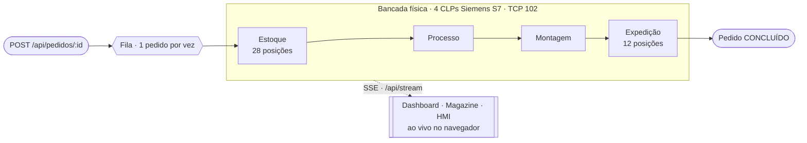

# Controladora da Bancada SMART 4.0

**MES** (_Manufacturing Execution System_) para uma bancada de manufatura **Indústria 4.0**: recebe pedidos, consome estoque, comanda **4 CLPs Siemens S7** ao longo da linha e transmite o estado da bancada **ao vivo** para o navegador.


> **Situação de Aprendizagem — 3º Semestre · Técnico em Desenvolvimento de Sistemas · SENAI**

---

## O fluxo da bancada

Um pedido entra pela fila (um por vez), atravessa as quatro estações físicas comandadas por CLP e sai concluído. O estado de cada estação e das grades de estoque/expedição chega ao navegador por **SSE** — sem polling.



**Status do pedido:** `PENDENTE → PRODUCAO → CONCLUIDO` — a conclusão é automática quando o CLP de expedição guarda a OP, ou manual via `PUT /api/pedidos/{id}/status`.

---

## O que faz

| Módulo | Descrição |
|---|---|
| 📦 **Pedidos** | CRUD de pedidos (bloco → lâminas → tampa), com OP escolhível ou automática; edição só enquanto `PENDENTE` |
| 🧵 **Fila de produção** | Serializa a bancada em **um pedido por vez** (`PedidoConsumerList`); o banco é a fonte da verdade e a fila é recomposta no boot |
| 🔲 **Estoque** | 28 posições de blocos, aplicação de cor por posição e validação de disponibilidade |
| 🚚 **Expedição** | 12 posições; histórico rastreável de todos os pedidos que passaram por cada posição |
| 🛰️ **Integração CLP (S7)** | Cliente S7 próprio sobre TCP 102 para as 4 estações; IP e intervalo de _polling_ **configuráveis em runtime**, sockets _fail-fast_ e _ping_ de liveness |
| 📡 **Tempo real (SSE)** | `ClpEventoCoordinator` publica **só quando muda** (estado das estações, grades, heartbeat); o navegador recebe por `EventSource` |
| 🧊 **Visualizador 3D** | Preview do pedido em Three.js (importmap, **sem build step**) na tela de pedidos e no formulário |
| 🧰 **Frontend MES** | Páginas Thymeleaf: dashboard (monitor), magazine (operação), estações (HMI), configuração |
| 📄 **Swagger / OpenAPI** | Spec e UI navegável em `/swagger-ui.html` |

---

## Stack

```
Java 17  ·  Spring Boot 4.0.6  ·  Spring Web MVC  ·  Spring Data JPA + Hibernate  ·  MySQL 8 (HikariCP)
Thymeleaf (SSR)  ·  SSE (SseEmitter)  ·  Cliente Siemens S7 (TCP 102)  ·  Lombok  ·  springdoc-openapi 3.x
Frontend: ES modules vanilla + Three.js 0.176 (sem build)  ·  Maven Wrapper
```

> ⚠️ Spring Boot **4** é recente: Jackson é `tools.jackson.*` (não `com.fasterxml.*`) e o starter web é `spring-boot-starter-webmvc`. O `starter-websocket` está no classpath por herança histórica, mas **não há canal WebSocket** — o tempo real é **SSE**.

---

## Arquitetura

Camadas `controller → service → repository → model` (entidades JPA), com `dto/` na fronteira e `model/enums/`. Dois estilos de controller: **REST** (`/api/**`, devolvem DTOs) e **MVC** (`PageController`, devolve views Thymeleaf).

```
app_smart_4.0/                          ← projeto Maven (rode os comandos aqui, não na raiz)
└── src/main/
    ├── java/com/tecdes/smart/app_smart_40/
    │   ├── controller/       ← REST (Pedido, Estoque, Expedicao, ClpIp/Polling/Comando/ModoLeitura, Tampa)
    │   │                        + PageController (Thymeleaf) + GlobalExceptionHandler
    │   ├── service/          ← regras de negócio (Pedido, Estoque, Expedicao, Bloco, Lamina)
    │   │   ├── SmartService  ← orquestra PENDENTE → PRODUCAO (reserva, deduz estoque, escreve no CLP)
    │   │   ├── clp/          ← integração S7: scheduler, registries de IP/polling, writers, fila de pedidos
    │   │   └── sse/          ← ClpEventoCoordinator (mudou→publica) + SseController + notifier/registry
    │   ├── repository/  ·  dto/  ·  model/ (+ model/enums)
    │   └── Application.java  ← @EnableScheduling/@EnableAsync + @OpenAPIDefinition
    └── resources/
        ├── templates/        ← Thymeleaf: home, dashboard, magazine, estacoes, configuracao, pedidos, formulario
        ├── static/js/        ← pages/ · core/ · components/  (Api, Toast, createSse, pedidoViewer…)
        ├── static/css · img · fonts
        └── application.properties
```

### Integração com o CLP (o coração do projeto)

- **Um único leitor do socket S7:** o _handshake_ de leitura/escrita roda no _write path_ (`ClpComandoService` + `*ClpService`), disparado pelo `ClpProcessamentoScheduler`. Ele faz **ping** antes de falar; se a estação não responde, pula a passada (não trava).
- **Configurável em runtime, sem restart:** IP por estação (`PUT /api/clp/ips/{estacao}`) e intervalo de _polling_ por estação (`PUT /api/clp/polling/{estacao}`) — editados na página `/configuracao`.
- **Só lê quando alguém está olhando:** a leitura é _gated_ pela presença de cliente SSE — abrir qualquer página que consome `/api/stream` liga a leitura das 4 estações; fechar a última aba a desliga.
- **Tampa via ESP32:** chamada REST opcional para selecionar a tampa física (`/api/config/tampa` liga/desliga).

### Tempo real (SSE) — `service/sse/`

`ClpEventoCoordinator` é o único ponto _"mudou → publica"_: compara a assinatura do bean lido e emite eventos só na mudança (`estacao-status`, `estacao-all`, `estoque`, `expedicao`, `estacao-heartbeat`). `SseEmitterRegistry` guarda o último snapshot por evento e **reenvia ao cliente que acabou de conectar**. Substituiu o antigo _polling_ de 3s do dashboard.

---

## Modelo de dados

```
Pedido ──1:N──▶ Bloco ──1:N──▶ Lamina        Estoque (28 posições)     Expedicao (12 posições)
  id            cor (enum)      cor (enum)      nrPosicao                 posicao
  ordemProducao pedido →        padrao          bloco →                   pedidoAtual →  (histórico via FK)
  status        estoque →       posicaoBloco →
  tipoPedido    laminas →
  corTampa
  dataCriacao
```

Os **enums carregam um `value` inteiro** — é esse `int` que trafega no JSON e precisa ficar em sincronia com `static/js/core/enums.js`.

**Enums:** `AndarBloco` · `CorBloco` · `CorLamina` · `CorTampa` · `EstacoesCLP` · `PadraoLamina` · `PosicaoLamina` · `StatusPedido` · `TipoPedido`

---

## API REST

**Base:** `http://localhost:8088` · **Spec completa e navegável:** [`/swagger-ui.html`](http://localhost:8088/swagger-ui.html)

| Grupo | Endpoints |
|---|---|
| **Pedidos** `/api/pedidos` | `GET` lista · `GET /fila` · `POST` cria · `PUT /{id}` edita (PENDENTE) · `POST /{id}` enfileira p/ produção · `PUT /{id}/status` conclui |
| **Estoque** `/api/estoque` | `GET` grade · `GET /disponivel` · `PUT /adicionar` · `PUT /remover/{nrPosicao}` |
| **Expedição** `/api/expedicao` | `GET` grade · `GET /livre` · `DELETE /{posicao}` limpa · `GET /{posicao}/pedidos` histórico |
| **CLP — IPs** `/api/clp/ips` | `GET` · `PUT /{estacao}` |
| **CLP — Polling** `/api/clp/polling` | `GET` · `PUT /{estacao}` |
| **CLP — Comando** `/api/clp` | `POST /processar` (todas) · `POST /{estacao}/processar` |
| **CLP — Somente-leitura** `/api/clp/somente-leitura` | `GET` · `PUT` |
| **Tampa** `/api/config/tampa` | `GET` · `PUT` |
| **Tempo real** `/api/stream` | `GET` `text/event-stream` (SSE) |

### Páginas web (Thymeleaf)

`/` home · `/dashboard` monitor (somente leitura) · `/magazine` operação do estoque/expedição · `/estacoes` HMI por estação · `/configuracao` IPs, polling e tampa · `/pedidos` lista + fila + 3D · `/formulario` criar/editar pedido (`?id=N`)

---

## Como executar

**Requisitos:** Java 17 · Maven (via wrapper) · MySQL 8 em `localhost:3306` com o banco `DB_SMART_4_0`.

```bash
git clone https://github.com/William-Colasso/controladora-bancada-smart-4.0.git
cd controladora-bancada-smart-4.0/app_smart_4.0     # o projeto Maven vive aqui, não na raiz

# banco (defaults: usuário root / senha senai)
mysql -u root -p -e "CREATE DATABASE DB_SMART_4_0;"

# rodar (Windows: mvnw.cmd)
./mvnw spring-boot:run
```

A aplicação sobe em **`http://localhost:8088`**. Na primeira execução, `ddl-auto=update` cria as tabelas e o `DataInitializer` semeia **28 posições de estoque** e **12 de expedição**.

**Configuração por ambiente:** os defaults ficam em `application.properties`; sobrescreva com um arquivo **`.env`** (formato _properties_) na pasta `app_smart_4.0/` — chaves `DB_URL`, `DB_USERNAME`, `DB_PASSWORD`, `SERVER_PORT` (variáveis de ambiente do SO também funcionam). Os IPs iniciais dos CLPs vêm de `clp.ip.*` e podem ser trocados em runtime na tela `/configuracao`.

```bash
./mvnw clean package                 # build
./mvnw test                          # testes (unitários, Mockito)
./mvnw test -Dtest=PedidoServiceTest # uma classe
```

---

## Branches

| Branch | Finalidade |
|---|---|
| `main` | Versão estável e revisada |
| `develop` | Integração ativa do desenvolvimento |
| `feat/*` · `fix/*` · `docs/*` | Trabalho de curta duração, mesclado via PR |

---

## Licença

Distribuído sob a licença **MIT** — consulte [`LICENSE`](LICENSE).

---

<div align="center">

**Desenvolvido por [William Colasso](https://github.com/William-Colasso)**
`Técnico em Desenvolvimento de Sistemas · SENAI`

</div>
